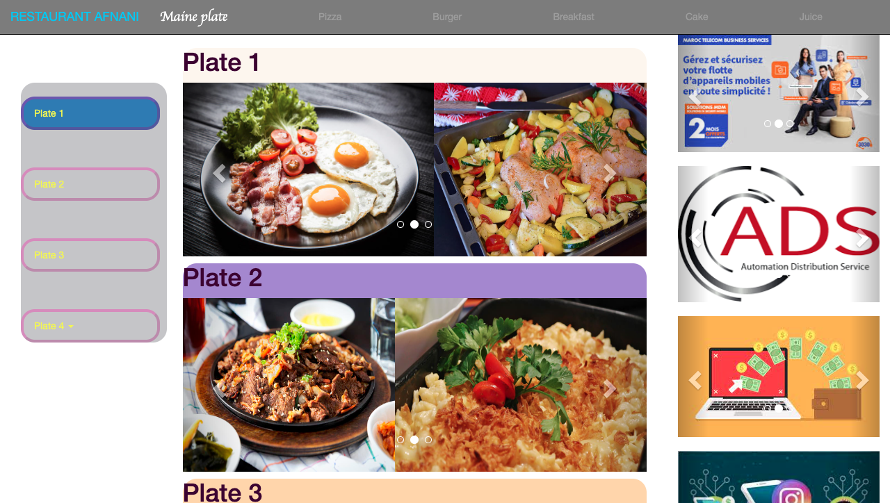

# Restaurant

A simple ``` web application ``` for a restaurant that allows customers to view the menu and place orders online.

## Screenshots

### Home

### Maine-Plate

### Juice

### Cake


## Features

- [x] View menu items with prices and descriptions
- [ ] Add items to cart
- [ ] Place an order
- [ ] View order history

## Technology Stack

- HTML
- CSS
- JavaScript

## Getting Started

### Clone the repository
```git clone https://github.com/Abdelilah-Falih/restaurant.git```

## Contributing

Contributions are welcome! Please feel free to submit a pull request.


